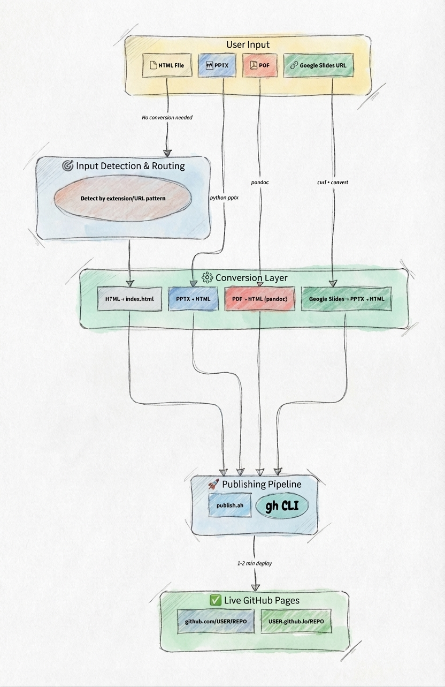

# publish-to-pages

Give it a file. Get a live GitHub Pages URL.

An agent skill that publishes presentations and web content to GitHub Pages. Works with **any AI coding agent**: Copilot CLI, Claude Code, Gemini CLI, OpenClaw, or anything that reads skill files.

HTML, PPTX, PDF, or Google Slides → GitHub repo → GitHub Pages → live URL.

## Architecture



## Getting Started

### 1. Clone this repo

```bash
gh repo clone AndreaGriffiths11/publish-to-pages
```

### 2. Make sure `gh` CLI is installed and authenticated

```bash
gh auth status
```

### 3. Tell your agent to use it

**Copilot CLI:**
```
Read the SKILL.md in ~/path/to/publish-to-pages and use it to publish my-slides.pptx to GitHub Pages
```

**Claude Code:**
```
Read ./publish-to-pages/SKILL.md and follow the instructions to publish my-talk.html to GitHub Pages
```

**Any other agent:**
```
Read [path-to]/publish-to-pages/SKILL.md and use it to publish [your-file] to GitHub Pages
```

That's it. The agent reads the instructions, runs the scripts, and gives you a live URL.

## What It Does

1. Detects your input type (HTML, PPTX, PDF, or Google Slides URL)
2. Converts to HTML if needed — preserving formatting, colors, images, and backgrounds
3. Creates a GitHub repo (public by default; specify private if you have a paid plan)
4. Pushes the content and enables GitHub Pages
5. Returns the live URL: `https://username.github.io/repo-name/`

## Supported Inputs

| Input | What happens |
|-------|--------------|
| **HTML** (.html, .htm) | Published directly as-is |
| **PPTX** (.pptx) | Converted to HTML with formatting, colors, images, and backgrounds preserved |
| **PDF** (.pdf) | Each page rendered as an image and embedded in a navigable HTML presentation |
| **Google Slides** | Exported as PPTX, then converted to HTML |

## Repo Visibility

Repos are created **public** by default. If you want a private repo, just tell your agent — but note that GitHub Pages on private repos requires a Pro, Team, or Enterprise plan.

## Optional Dependencies

For PPTX conversion:
```bash
pip install python-pptx
```

For PDF conversion:
```bash
brew install poppler       # macOS
apt install poppler-utils  # Ubuntu/Debian
```

The skill tells you if you need them — no setup required upfront.

## Files

```
publish-to-pages/
├── SKILL.md              # Agent instructions
├── README.md             # This file
└── scripts/
    ├── publish.sh        # Creates repo, pushes, enables Pages
    ├── convert-pptx.py   # Converts PPTX → HTML presentation
    └── convert-pdf.py    # Converts PDF → HTML presentation
```

## Links

- [see a demo](https://andreagriffiths11.github.io/publish-to-pages-site/)
- [awesome-copilot](https://github.com/github/awesome-copilot/tree/main/skills/publish-to-pages)
